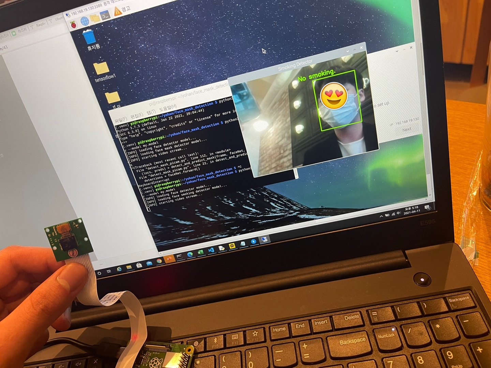
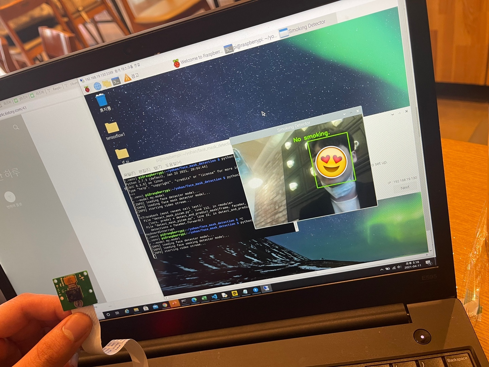
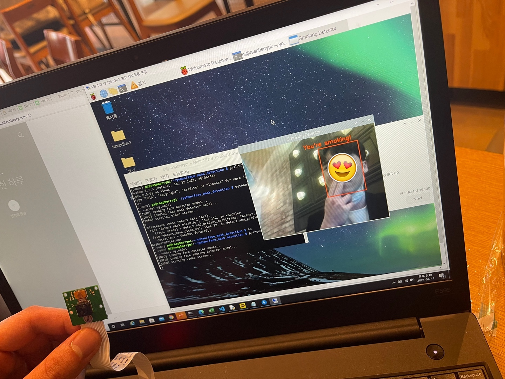
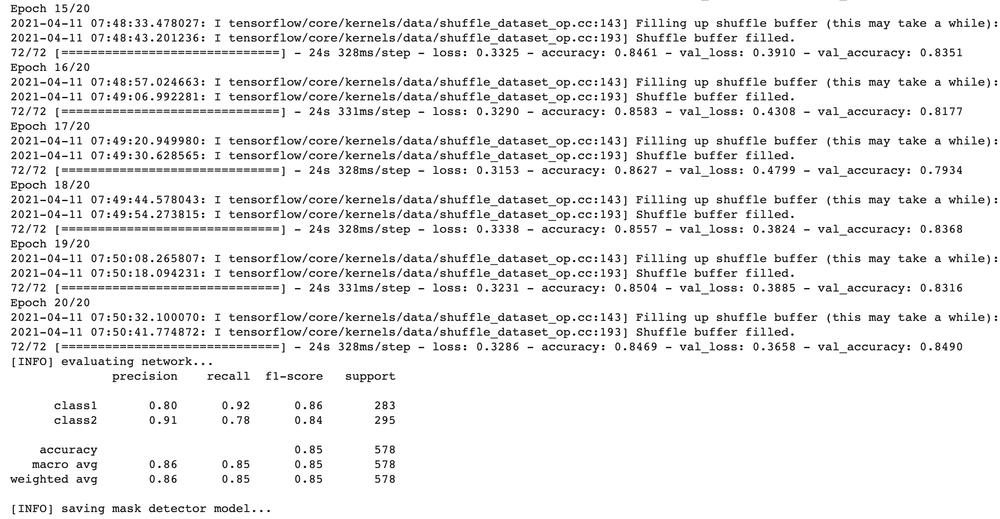

# Smoking detector





## Getting Started

This project use Raspberry Pi and Picam to detect smoking through real-time record.

### Prerequisties

1. Connect your Raspberry Pi with SSH.
2. Connect your Raspberry Pi Camera Module to your Raspberry Pi.

### Set Environment & Install

```shell
python3 -m venv .venv
source .venv/bin/activate
pip3 install -r requirements.txt
```

### Usage

```py
python3 detect_smoking.py
```

### Train

* You must train Tensorflow version 2.0.0.

If you wanna train your own model, must exist datasets. (No need to be splitted into a train and test sets.)

```py
python3 train_smoking_detector.py -d DATASET_DIR -m MODEL_NAME
```

If you will train model in 'Colab', refer to .ipynb file.

After saving the model, run the code below.
```py
python3 detect_smoking.py -m YOUR_MODEL_NAME
```

### Model Performance



### reference

https://github.com/carolinedunn/face_mask_detection
